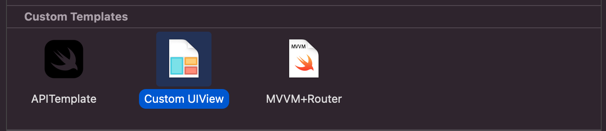

# CustomUIView-Template
Custom UIView template for Xcode

## XCode iOS Templates location

All the Xcode custom template files are located in **~/Library/Developer/Xcode/Templates/** and grouped into sections by folder name. 
You can add it manually or using the terminal by running the following command:

**mkdir ~/Library/Developer/Xcode/Templates/Custom Templates**

## Template main folder

Each XCode file template is a separate folder with the extension .xctemplate. If you want to create a template named "View, Model & ViewModel", you have to create a folder named "View, Model & ViewModel.xctemplate" in **~/Library/Developer/Xcode/Templates/File Templates/Custom Templates**

Visit my blog for more info: [www.oscargarrucho.com](http://www.oscargarrucho.com/)

### Credits to:

<a href="https://www.flaticon.com/free-icons/templates" title="templates icons">Templates icons created by Freepik - Flaticon</a>

## MIT License

Copyright (c) 2018 Chester How

Permission is hereby granted, free of charge, to any person obtaining a copy of this software and associated documentation files (the "Software"), to deal in the Software without restriction, including without limitation the rights to use, copy, modify, merge, publish, distribute, sublicense, and/or sell copies of the Software, and to permit persons to whom the Software is furnished to do so, subject to the following conditions:

The above copyright notice and this permission notice shall be included in all copies or substantial portions of the Software.

THE SOFTWARE IS PROVIDED "AS IS", WITHOUT WARRANTY OF ANY KIND, EXPRESS OR IMPLIED, INCLUDING BUT NOT LIMITED TO THE WARRANTIES OF MERCHANTABILITY, FITNESS FOR A PARTICULAR PURPOSE AND NONINFRINGEMENT. IN NO EVENT SHALL THE AUTHORS OR COPYRIGHT HOLDERS BE LIABLE FOR ANY CLAIM, DAMAGES OR OTHER LIABILITY, WHETHER IN AN ACTION OF CONTRACT, TORT OR OTHERWISE, ARISING FROM, OUT OF OR IN CONNECTION WITH THE SOFTWARE OR THE USE OR OTHER DEALINGS IN THE SOFTWARE.
